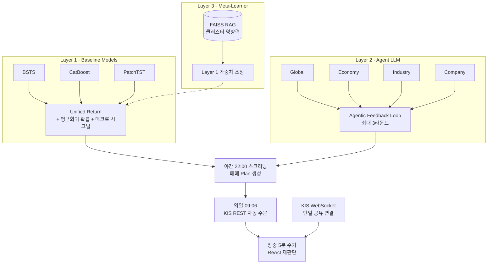

# 아키텍처

## 1. 아키텍처

```mermaid
flowchart TB
    subgraph L1[Layer 1 · Baseline Models]
        B1[BSTS] & B2[CatBoost] & B3[PatchTST] --> U[Unified Return<br/>+ 평균회귀 확률 + 매크로 시그널]
    end
    subgraph L2[Layer 2 · Agent LLM]
        G[Global] & E[Economy] & I[Industry] & C[Company] --> F[Agentic Feedback Loop<br/>최대 3라운드]
    end
    subgraph L3[Layer 3 · Meta-Learner]
        R[(FAISS RAG<br/>클러스터 영향력)] --> W[Layer 1 가중치 조정]
    end
    U --> P[야간 22:00 스크리닝<br/>매매 Plan 생성]
    F --> P
    W -.-> U
    P --> O[익일 09:06<br/>KIS REST 자동 주문]
    O --> RT[장중 5분 주기<br/>ReAct 재판단]
    WS[KIS WebSocket<br/>단일 공유 연결] --> RT
```

---

- 이전 문서: [프로젝트 개요](00-overview.md)
