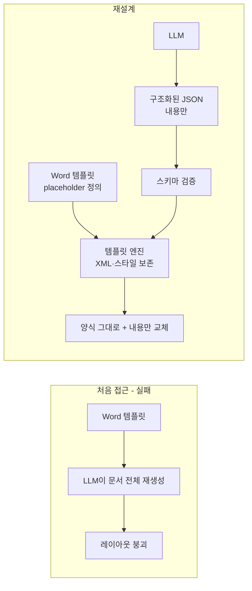

# 아키텍처

## 1. 구조적 판단의 전환

```mermaid
flowchart LR
    subgraph Before[처음 접근 - 실패]
        T1[Word 템플릿] --> L1[LLM이 문서 전체 재생성] --> D1[레이아웃 붕괴]
    end
    subgraph After[재설계]
        T2[Word 템플릿<br/>placeholder 정의] --> E[템플릿 엔진<br/>XML·스타일 보존]
        L2[LLM] --> J[구조화된 JSON<br/>내용만] --> V[스키마 검증] --> E
        E --> D2[양식 그대로 + 내용만 교체]
    end
```

---

- 이전 문서: [프로젝트 개요](00-overview.md)
